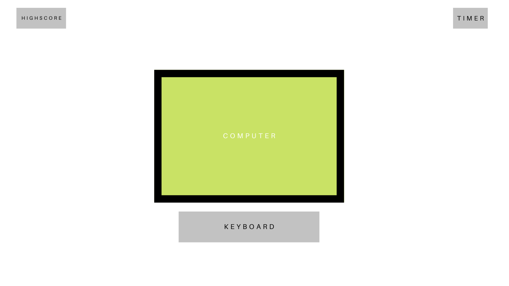

# The Code Quiz

## Description 

Provide a short description explaining the what, why, and how of your project. Use the following questions as a guide:

- By creating this quiz, I can show off my ability of programming variables, loops, and control structures for future employers.
- JavaScript allows you to create quizzes that are more interactive and engaging for users. For example, you can use JavaScript to create quizzes that include images, videos, or other interactive elements.
- What problem does it solve?  Javascript allows access on a variety of devices and platforms, including computers, tablets, and smartphones.
- JavaScript is commonly used for web development, so creating a quiz in JavaScript helped me learn web development skills such as HTML, CSS, Javascript, and DOM manipulation. 

## Usage 🏆 

## License

MIT License

Copyright (c) [2023] [Christian Plasencia]

Permission is hereby granted, free of charge, to any person obtaining a copy
of this software and associated documentation files (the "Software"), to deal
in the Software without restriction, including without limitation the rights
to use, copy, modify, merge, publish, distribute, sublicense, and/or sell
copies of the Software, and to permit persons to whom the Software is
furnished to do so, subject to the following conditions:

The above copyright notice and this permission notice shall be included in all
copies or substantial portions of the Software.

THE SOFTWARE IS PROVIDED "AS IS", WITHOUT WARRANTY OF ANY KIND, EXPRESS OR
IMPLIED, INCLUDING BUT NOT LIMITED TO THE WARRANTIES OF MERCHANTABILITY,
FITNESS FOR A PARTICULAR PURPOSE AND NONINFRINGEMENT. IN NO EVENT SHALL THE
AUTHORS OR COPYRIGHT HOLDERS BE LIABLE FOR ANY CLAIM, DAMAGES OR OTHER
LIABILITY, WHETHER IN AN ACTION OF CONTRACT, TORT OR OTHERWISE, ARISING FROM,
OUT OF OR IN CONNECTION WITH THE SOFTWARE OR THE USE OR OTHER DEALINGS IN THE
SOFTWARE.

---

## Badges

Badges aren't necessary, but they demonstrate street cred. Badges let other developers know that you know what you're doing. Check out the badges hosted by [shields.io](https://shields.io/). You may not understand what they all represent now, but you will in time.

## Features

- Timed test
- When user is wrong it subtracts time.
- store high score using local storage under the users ID. 
- Clear highscores

